# NyxTrace

<p align="center">
  
</p>

<p align="center">
  <em>AI-Powered Digital Forensics Platform — Blockchain-Anchored Evidence Integrity</em>
</p>

<p align="center">
  <a href="#-architecture"></a>
  <a href="#-quick-start"></a>
  <a href="#-api-reference"></a>
  <a href="#-sandbox-scenarios"></a>
  <a href="#-blockchain-module"></a>
</p>

<p align="center">
  
  
  
  
  
  
  
  
  
  
  
  
  
  
  
  
  
  
</p>

> **Disclaimer:** This software is for educational and research purposes only. It simulates malware behavior in a controlled sandbox to teach forensic analysis. Use only on systems you own or are authorized to test.

---

## Table of Contents

- [Overview](#-overview)
- [Architecture](#-architecture)
- [Services](#-services)
  - [Backend (Express.js)](#backend-expressjs--typescript)
  - [Frontend (React + Vite)](#frontend-react--vite)
  - [AI Service (FastAPI)](#ai-service-fastapi)
  - [Blockchain (Solidity + Hardhat)](#blockchain-solidity--hardhat)
  - [Sandbox Agent (FastAPI + VirtualBox)](#sandbox-agent-fastapi--virtualbox)
- [Simulator Realism Roadmap](#-simulator-realism-roadmap)
- [Blockchain Module](#-blockchain-module)
- [API Reference](#-api-reference)
- [RBAC](#-roles--permissions-rbac)
- [Quick Start](#-quick-start)
- [Project Structure](#-project-structure)
- [Observability](#-observability)
- [Documentation](#-documentation)
- [Contributing](#-contributing)
- [License](#-license)

---

## Overview

NyxTrace is a full-stack cybersecurity forensics platform designed for safe malware behavior simulation, AI-powered threat analysis, and blockchain-anchored evidence verification. It combines six realistic but safe behavioral simulators running inside a VirtualBox sandbox with a comprehensive forensic analysis pipeline.

| Area | Capability |
|------|-----------|
| **Multi-Role Auth** | OTP-based registration, JWT access + refresh tokens, 6 RBAC roles |
| **Sandbox Simulation** | VirtualBox headless sandbox, 6 safe behavioral simulators, WebSocket telemetry streaming, automatic snapshot rollback |
| **AI Threat Analysis** | FastAPI microservice — telemetry classification, Z-score anomaly detection, LLM router (Llama 3.2), severity scoring, investigation summarization |
| **Blockchain Evidence** | Ethereum smart contract (Solidity 0.8.20) for evidence hash anchoring, tamper detection, immutable audit trail, Merkle root packages |
| **Forensic Dashboard** | Real-time KPIs, D3.js force-directed threat intelligence graph, MITRE ATT&CK matrix, AI analysis panels, chain of custody timeline |
| **Chain of Custody** | Full custody timeline with integrity verification, tamper alerts with acknowledgment workflow, evidence lineage graphs |
| **Analytics** | Behavioral pattern analysis, session comparison, threat correlation, forensic reporting |
| **Observability** | Prometheus metrics, correlation ID tracing, structured JSON logging, aggregated health checks |

---

## Architecture

```
                    +-------------------------------------------------------+
                    |               Frontend (React + TypeScript + Vite)      |
                    |   Pages | Stores (Zustand) | API client | WS client    |
                    |   Framer Motion | D3.js Force Graph | Recharts Charts  |
                    +---------------------------+---------------------------+
                        | REST /api/v1              ^ WebSocket (Socket.IO)
                        v                           |
+--------------------------------------------------------+
|              Backend API (Express.js + TypeScript)       |
|  Auth/RBAC | Investigations | Evidence | Sandbox | AI   |
|  Blockchain | Health | Queues | Tracing                  |
+-------+-------------------+------------------------------+
    | HTTP              | HTTP                  | MongoDB
    v                   v                       v
+-----------+   +------------------+   +-------------------+
| AI Service|   | Sandbox Agent   |   | MongoDB           |
| (FastAPI) |   | (FastAPI :8765) |   | (local :27017)    |
| LLM Router|   | Pipeline + VBox |   | Investigations,   |
| Severity  |   | Telemetry WS    |   | evidence, alerts, |
| Anomalies |   | Logs WS         |   | sessions, IOCs    |
+-----+-----+   +-------+---------+   +-------------------+
      | HTTP              | VBoxManage
      v                   v
+-------------+  +----------------------+     +----------------------+
| Ollama      |  | VirtualBox VM        |     | Ethereum Blockchain  |
| llama3.2:3b |  | ForensicsSandbox     |     | (Hardhat / Sepolia)  |
| localhost   |  | Snapshot:            |     | EvidenceRegistry.sol |
| :11434      |  |   CleanBaselinePython|     | Audit trail + State  |
| JSON mode   |  | Simulators run here  |     +----------------------+
+-------------+  +----------------------+
```

### Technology Stack

| Layer | Technology |
|-------|-----------|
| **Frontend** | React 19, TypeScript 6.0, Vite 8, Zustand 5, React Router 7, Framer Motion 12, Socket.IO client, D3.js, Three.js with `@react-three/fiber`, Tailwind CSS 4, Lucide icons |
| **Backend** | Express.js 4, TypeScript 5.3, Mongoose 8, Socket.IO 4, Ethers.js 6, Winston, Helmet, express-rate-limit, Joi, bcryptjs, Multer, Nodemailer, PDFKit |
| **AI Service** | FastAPI 0.104+, Pydantic v2, scikit-learn, pandas, httpx, uvicorn, Ollama (Llama 3.2) |
| **Sandbox Agent** | FastAPI, VirtualBox (VBoxManage), WebSocket streaming, 6 behavioral simulators |
| **Blockchain** | Solidity 0.8.20, Hardhat 2.19, Ethers.js 6, Chai, Sepolia testnet / local Hardhat node |
| **Database** | MongoDB 7 (local or Atlas), Mongoose ODM |
| **Auth** | JWT access + refresh tokens, OTP via SMTP (Nodemailer), RBAC with 6 roles |

---

## Services

### Backend (Express.js + TypeScript)

| Metric | Value |
|--------|-------|
| **Source files** | 100+ across 8 directories |
| **Route modules** | 22 (`/api/v1/*`) |
| **Mongoose models** | 13 (18+ schemas including blockchain) |
| **Services** | 30 (19 exported from index) |
| **Controllers** | 21 |
| **Middleware** | 7 (auth, error, security, tracing, validation, request-context) |
| **Tests** | 6 files, ~91 test cases (Jest) |
| **Port** | `:3000` |

Route modules mounted under `/api/v1`:

| Prefix | Purpose |
|--------|---------|
| `/auth` | Login, register, OTP, password reset, refresh tokens |
| `/users` | User CRUD, stats, role management, activity |
| `/investigations` | Case management, forensic reports |
| `/evidence` | File upload, integrity verification |
| `/sandbox` | Session lifecycle, VM control, telemetry |
| `/sync` | Evidence upload, telemetry ingestion, heartbeat |
| `/ai` | Telemetry analysis, alert enrichment, investigation summary |
| `/blockchain` | 44 endpoints — verification, sync, workers, reconciliation |
| `/custody` | Chain of custody, timeline, tamper investigations |
| `/threat` | IOC management, threat correlation, enrichment |
| `/analytics` | Behavioral patterns, anomaly detection, clustering |
| `/operations` | Aggregated health, Prometheus metrics |
| `/reports` | Forensic report generation and export |
| `/logs` | Audit log viewer |
| `/alerts` | Alert management |
| `/analysis` | Document/URL analysis (heuristic + optional LLM enhancement) |
| `/knowledge-base` | Knowledge article CRUD |
| `/roles` | RBAC role/permission enumeration |
| `/config` | Dynamic runtime configuration |
| `/evidence/artifacts` | Evidence artifact management |
| `/threat-analysis` | Session threat intelligence |

### Frontend (React + Vite)

| Metric | Value |
|--------|-------|
| **Source files** | 75 (68 `.ts`/`.tsx`) |
| **Pages** | 24 (22 lazy-loaded) |
| **Zustand stores** | 16 |
| **Components** | 19 (UI, layout, blockchain, threat-intel, visualizations) |
| **Tests** | 4 files (Vitest + React Testing Library) |
| **Port** | `:5173` (dev), Vite proxies `/api` → `:3000` |

Key pages:
- **EnhancedDashboardPage** — KPI cards, real-time charts, alert feed
- **EvidenceExplorerPage** — Evidence grid + blockchain verification
- **BlockchainOperationsPage** — Sync/worker/health management
- **ChainOfCustodyPage** — Custody timeline + tamper alerts
- **AIAnalysisPage** (1513 lines) — Full AI classification + anomaly display
- **SandboxDashboardPage** (1274 lines) — Session management + live telemetry
- **ThreatIntelligencePage** — D3 force graph + IOC browser
- **ForensicAnalyticsPage** — MITRE ATT&CK heatmap + correlation
- **LiveTelemetryPage** — Real-time WebSocket event stream

Zustand stores: `authStore`, `blockchainStore` (40+ actions), `evidenceStore`, `investigationStore`, `alertStore`, `sandboxStore`, `telemetryStore`, `analysisStore`, `reportsStore`, `logsStore`, `realtimeStore`, `threatIntelStore`, `timelineStore`, `statusStore`, `settingsStore`, `themeStore`.

### AI Service (FastAPI)

| Metric | Value |
|--------|-------|
| **Source files** | 35 |
| **Endpoints** | 7 (telemetry, forensic report, document + URL LLM enhancement, alert enrichment, investigation summary, executive report, health) |
| **Modules** | 6 (telemetry analysis, threat classification, severity scoring, anomaly detection, feature extraction, summarization) |
| **LLM integration** | Dual-path: heuristic pipeline (default) or Llama 3.2 router |
| **Tests** | 3 files, 25 tests (pytest + pytest-asyncio) |
| **Port** | `:8000` |

Analysis pipeline (5 stages executed in thread pool):
1. **Feature Extraction** — process/file/registry/network features with fuzzy matching
2. **Threat Classification** — 10 categories with rule-based confidence scoring
3. **Anomaly Detection** — Z-score temporal, behavioral, process, network anomalies
4. **Severity Scoring** — 0-100 score with weighted factors + threat classification boosts
5. **Summary Generation** — executive/analyst summaries, key findings, recommendations

LLM Router (when `AI_LLM_ENABLED=true` + `AI_LLM_PRIMARY_PATH=true`):
- Single comprehensive Llama 3.2 call replaces all 5 heuristic modules
- Returns classification, MITRE mapping, attack chain, severity, narrative
- Temperature 0.1, max 2000 response tokens, max 50 events in prompt
- Falls back to heuristic pipeline on network error or invalid JSON

Document & URL LLM Enhancement (`AI_LLM_ENABLED=true` only — enhancer, never replaces):
- PDF/DOCX and URL analyses run their heuristics first; the LLM then adds a **second opinion** — executive narrative, classification opinion, suggested MITRE techniques, and recommendations
- The heuristic verdict (score/level) is never overridden — the LLM output is purely supplemental
- Non-blocking: when Ollama is unreachable or returns invalid JSON, the analysis completes normally with heuristic results and no `aiInsights`
- Insights are persisted on the `AnalysisReport` (`aiInsights` field) and rendered as an "AI Assessment" card on the Threat Intelligence page
- Endpoints: `POST /api/v1/analyze/document`, `POST /api/v1/analyze/url` (always 200; `llm_available=false` when the LLM is disabled)

### Blockchain (Solidity + Hardhat)

| Metric | Value |
|--------|-------|
| **Contract** | `EvidenceRegistry.sol` (538 lines) |
| **State machine** | 4 states: PENDING → REGISTERED → TRANSFERRED → LOCKED |
| **Tests** | 24 passing test cases |
| **Events** | 9 (EvidenceRegistered, EvidenceVerified, VerificationFailed, etc.) |
| **Contract features** | Single/batch registration, verification, tamper detection with `CriticalAuditEvent`, comprehensive audit system (categories 0-3), investigation grouping |
| **Port** | `:8545` (Hardhat), Sepolia testnet supported |

### Sandbox Agent (FastAPI + VirtualBox)

| Metric | Value |
|--------|-------|
| **Simulators** | 6 safe behavioral scenarios |
| **Helper modules** | 11 shared utilities |
| **Pipeline stages** | REVERT → BOOT → STAGE → EXECUTE → OBSERVE → COMPLETE |
| **Endpoints** | 14 HTTP + 2 WebSocket (`/telemetry/live`, `/logs/live`) |
| **Tests** | 0 (identified gap) |
| **Port** | `:8765` |

---

## Simulator Realism Roadmap

| Phase | Status | Scope |
|-------|--------|-------|
| 1 — Anti-Analysis Gating | Complete | Environment-aware behavior gating (debugger, VM artifacts, analysis tools detection) |
| 2 — Real Process Injection | Complete | ctypes-based `CreateRemoteThread` + `WriteProcessMemory` into suspended `calc.exe` with benign shellcode |
| 3 — Network Beaconing | Complete | Domain fronting (HTTP Host header), DNS-over-HTTPS, jittered exponential-backoff heartbeats |
| 4 — Artifact Naming, Timing, Persistence | Complete | Realistic mutex/pipe/service names, operation-appropriate timing, WMI event subscription, COM hijacking |
| 5 — Defense Evasion & Discovery | Complete | 7 shared emitter functions — AMSI, ETW, UAC, system/process/software discovery, firewall rules |
| 6 — Persistence Depth | Complete | 5 shared emitters — Registry Run, Scheduled Task, WMI Subscription, Windows Service, COM Hijack |
| 7 — Data Obfuscation | Complete | XOR, Base64, RC4 encoding primitives with telemetry emitters |
| 8 — Discovery Depth | Complete | 9 shared emitters — account, domain trust, permission groups, network config/connections, system owner/location, shares, file/dir |
| 9 — Defense Evasion Depth | Complete | Defender disable, event log clear, indicator removal, timestomp, VSS delete, recovery inhibit, masquerade, logging disable |
| 10 — Impact Depth | Complete | Data destruction, service stop, system shutdown, disk wipe, resource hijacking (cryptominer), account lockout |
| 11 — Collection Depth | Complete | Clipboard monitoring, audio capture, input capture (keylog/formgrab), automated file collection, screen capture detail, browser/email collection |
| 12 — Execution Depth | Complete | PowerShell, WMI, rundll32, mshta, regsvr32, VBScript/JScript, BITSAdmin, CMSTP, malicious file lure |

### Shared Helper Modules (11)

| Module | Functions | MITRE Techniques |
|--------|-----------|-----------------|
| `defense_helper.py` | 7 | T1562.001, T1562.006, T1548.002, T1082, T1057, T1518, T1562.004 |
| `defense_evasion_helper.py` | 9 | T1562.001, T1070.001, T1070.004, T1070.006, T1070, T1490, T1036.005, T1562.008 |
| `discovery_helper.py` | 9 | T1087, T1482, T1069, T1016, T1049, T1033, T1614, T1083, T1135 |
| `execution_helper.py` | 9 | T1059.001, T1047, T1218.011, T1218.005, T1218.010, T1059.005, T1197, T1218.003, T1204.002 |
| `impact_helper.py` | 6 | T1485, T1489, T1529, T1561.001, T1496, T1531 |
| `collection_helper.py` | 7 | T1115, T1123, T1056, T1119, T1113, T1217, T1114 |
| `persistence_helper.py` | 5 | T1547.001, T1053.005, T1546.003, T1543.003, T1574.002 |
| `obfuscation_helper.py` | 3 | T1027 |
| `naming_helper.py` | 4 | T1036 — realistic naming + timing |
| `c2_helper.py` | 4 | T1071, T1090, T1573 — C2 beaconing |
| `telemetry_helper.py` | 3 | Core engine — emit, check_environment, set_phase |

### The 6 Simulators

| ID | Simulator | Behavior | Techniques |
|----|-----------|----------|------------|
| `system-service-alpha` | `ransomware_sim.py` | AES-256 encryption, shadow copy deletion, ransom note, wallpaper defacement, WMI subscription | T1486, T1490, T1547.001, T1491.001, T1546.003, T1027, T1485, T1561.001, T1529 |
| `system-service-beta` | `botnet_sim.py` | C2 beaconing (DNS + HTTP), process hollowing, bot config drop, resource hijacking | T1547.001, T1071.004, T1055.012, T1546.003, T1090, T1027, T1496, T1489 |
| `system-service-gamma` | `credential_stealer_sim.py` | Browser Login Data theft, SAM/LSA access, domain-fronted exfiltration | T1555.003, T1539, T1003.002, T1041, T1105, T1027, T1531 |
| `system-service-delta` | `sim_delta.py` | Keylogger hook, screenshot capture, audio recording, browser/email collection, COM hijacking | T1056.001, T1113, T1115, T1123, T1217, T1027, T1574.002, T1485 |
| `system-service-epsilon` | `sim_epsilon.py` | Real process injection (x64 shellcode), AMSI/ETW bypass, boot persistence, domain-fronted reverse shell | T1543.003, T1055, T1562.001, T1562.006, T1497, T1027, T1090, T1489, T1529 |
| `system-service-lateral` | `sim_lateral.py` | SMB port scan, pass-the-hash, remote service creation, WMI exec, SMB payload deployment | T1018, T1021.002, T1550.002, T1569.002, T1047, T1135, T1570, T1485, T1561.001 |

---

## Blockchain Module

The blockchain module anchors evidence integrity to an Ethereum smart contract.

### Smart Contract (`EvidenceRegistry.sol`)

- **State machine:** `PENDING (0) → REGISTERED (1) → TRANSFERRED (2) → LOCKED (3)`
- **Batch registration** for bulk evidence anchoring
- **On-chain verification** with hash comparison and immutable audit entries
- **Tamper detection** — emits `CriticalAuditEvent` when hashes don't match
- **9 events:** `EvidenceRegistered`, `EvidenceVerified`, `VerificationFailed`, `EvidenceStatusUpdated`, `AuditEntryCreated`, `CriticalAuditEvent`, `VerificationAuditEvent`, `EvidenceAuditEvent`
- **24 passing test cases**

### Backend Services (12 modules)

| Service | Lines | Purpose |
|---------|-------|---------|
| `blockchain.service.ts` | 214 | Web3 provider management, ethers.js dynamic import, graceful fallback |
| `smart-contract.service.ts` | 647 | Contract read/write, two ABIs (ForensicsEvidence + ForensicsAudit), event listeners |
| `hashing.service.ts` | 342 | SHA-256 fingerprinting, Merkle root computation, cache management |
| `synchronization.service.ts` | 618 | Background sync queue with 5s auto-processing, retry logic |
| `verification-orchestrator.service.ts` | 467 | Orchestrates hashing, DB records, and blockchain anchoring |
| `verification.service.ts` | 347 | Local evidence integrity verification (hash comparison) |
| `verification-worker.service.ts` | 452 | Parallel verification jobs with priority scheduling |
| `transaction.service.ts` | 537 | Transaction lifecycle, confirmation monitoring, gas tracking |
| `reconciliation.service.ts` | 410 | DB vs blockchain inconsistency detection + auto-resolution |
| `state-tracking.service.ts` | 418 | State snapshots, health score calculation (0-100) |
| `config.ts` | 68 | Env-based configuration (RPC URL, contract address, gas settings) |
| `types.ts` | 177 | 6 enums + 12 interfaces |

### API Endpoints (44 routes)

All under `/api/v1/blockchain`:

| Category | Endpoints |
|----------|-----------|
| **Status** | `GET /status` |
| **Verification** | `GET /verification/stats`, `POST /evidence/register`, `POST /evidence/verify`, `POST /evidence/batch-verify` |
| **Packages** | `POST /package/create`, `POST /package/verify` |
| **Audit** | `GET /audit`, `GET /audit/evidence/:id`, `POST /audit/record`, `POST /tamper/record` |
| **Integrity** | `GET /integrity/:investigationId`, `GET /alerts`, `POST /alerts/:evidenceId/:alertId/acknowledge` |
| **Contract** | `POST /contract/register`, `POST /contract/verify`, `GET /contract/evidence/:id`, `GET /contract/exists/:id` |
| **Transactions** | `GET /transactions`, `GET /transactions/stats`, `POST /transactions/:txId/retry` |
| **Sync** | `GET /sync/status`, `POST /sync/queue`, `POST /sync/process`, `POST /sync/retry`, `GET /sync/consistency/:id` |
| **Workers** | `GET /worker/status`, `POST /worker/job`, `GET /worker/job/:id`, `POST /worker/job/:id/cancel` |
| **Reconciliation** | `POST /reconciliation/run`, `GET /reconciliation/issues`, `POST /reconciliation/issues/:id/resolve`, `GET /reconciliation/stats`, `GET /reconciliation/check/:id` |
| **State** | `GET /state`, `GET /state/health`, `GET /state/metrics`, `GET /state/operations` |

---

## API Reference

### Auth & Users

| Method | Path | Roles | Description |
|--------|------|-------|-------------|
| POST | `/auth/register` | Public | Create account (sends OTP) |
| POST | `/auth/send-otp` | Public | Send / resend OTP |
| POST | `/auth/verify-otp` | Public | Verify OTP, return tokens |
| POST | `/auth/login` | Public | Email + password login |
| POST | `/auth/refresh` | Public | Exchange refresh token |
| POST | `/auth/logout` | Authenticated | Revoke refresh token |
| GET | `/auth/me` | Authenticated | Current user profile |
| GET | `/users` | admin+ | List all users |
| PATCH | `/users/:id` | admin+ | Update user role/status |

### Investigations & Evidence

| Method | Path | Roles | Description |
|--------|------|-------|-------------|
| GET/POST | `/investigations` | analyst+ | List / create investigations |
| GET/PATCH/DELETE | `/investigations/:id` | analyst+ | CRUD by ID |
| GET | `/evidence` | analyst+ | List evidence |
| POST | `/evidence/upload` | analyst+ | Upload evidence file |
| POST | `/evidence/:id/verify` | analyst+ | Verify evidence integrity |

### Sandbox

| Method | Path | Roles | Description |
|--------|------|-------|-------------|
| GET | `/sandbox/health` | auditor+ | Runtime health |
| GET | `/sandbox/simulators` | analyst+ | Simulator catalog |
| GET/POST | `/sandbox/sessions` | operator+ | List / start session |
| GET | `/sandbox/sessions/:id` | analyst+ | Session detail |
| POST | `/sandbox/sessions/:id/stop` | operator+ | Graceful stop |
| POST | `/sandbox/sessions/:id/terminate` | operator+ | Force terminate + rollback |

### Operations

| Method | Path | Description |
|--------|------|-------------|
| GET | `/operations/health` | Aggregated per-service health |
| GET | `/operations/ready` | K8s readiness probe |
| GET | `/operations/live` | K8s liveness probe |
| GET | `/operations/metrics` | Prometheus metrics |

---

## Roles & Permissions (RBAC)

| Role | Typical Use | Notable Permissions |
|------|-------------|-------------------|
| `super_admin` | Owner | Everything |
| `admin` | Platform operator | User management, runtime control |
| `forensic_analyst` | Investigator | Investigations, evidence, alerts, sandbox execute |
| `security_reviewer` | Reviewer | Read-only across investigations, evidence, alerts |
| `sandbox_operator` | Sandbox console | Sandbox sessions only |
| `auditor` | Compliance | Audit logs, custody chain, read-only evidence |

### Registration Flow

| Method | Available Roles | Who Can Do It |
|--------|----------------|---------------|
| Self-registration (`/register`) | `forensic_analyst`, `admin` | Public |
| User management panel (`/users`) | All 6 roles | `admin`/`super_admin` only |
| Role assignment page (`/roles`) | All 6 roles | `super_admin` only |

---

## Quick Start

### Prerequisites

| Requirement | Version | Notes |
|-------------|---------|-------|
| Node.js | 20.11+ | Backend + frontend + CLI (services work on 18+, `nyx.cmd` CLI needs 20.11+) |
| npm | 9+ | Bundled with Node |
| Python | 3.11+ | AI service + sandbox agent |
| MongoDB | 7.0 | Local or Atlas |
| VirtualBox | 6.1+ | Only for sandbox execution |

### Linux / macOS

```bash
git clone <repo-url> nyxtrace
cd nyxtrace

# Backend
cd backend
npm install
cp .env.example .env    # fill MONGODB_URI, JWT_SECRET, JWT_REFRESH_SECRET
npm run dev              # http://localhost:3000

# Frontend (new terminal)
cd frontend
npm install
npm run dev              # http://localhost:5173
```

### Windows

```bat
git clone <repo-url> nyxtrace
cd nyxtrace

REM CLI dependencies (required before running nyx.cmd)
npm install

REM Backend
cd backend
npm install
copy .env.example .env
cd ..

REM Frontend
cd frontend
npm install
cd ..

REM AI service
cd ai-service
python -m venv .venv
.venv\Scripts\pip install -r requirements.txt
cd ..

REM Sandbox agent
cd sandbox-agent-v2
python -m venv .venv
.venv\Scripts\pip install -r requirements.txt
cd ..

REM Blockchain (optional — for on-chain evidence anchoring)
cd blockchain
npm install
cd ..
```

Then start everything from the repo root:

```bat
nyx.cmd
```

PowerShell alternative (`start-all.ps1` is blocked by the default ExecutionPolicy unless bypassed):

```powershell
powershell -ExecutionPolicy Bypass -File start-all.ps1
```

To start without a specific service (e.g. sandbox requires a VirtualBox VM):

```bat
npm run nytx -- start --skip sandbox
```

Windows-specific notes:

- **MongoDB** — install as a Windows service (or use Atlas); the backend retries the connection 5× before exiting.
- **Ollama (optional)** — install Ollama for Windows, then `ollama pull llama3.2`; the CLI auto-detects Ollama and enables LLM enhancements.
- **VirtualBox** — only needed for sandbox execution; `VBoxManage.exe` is auto-detected under the Oracle/VirtualBox install paths.
- On a fresh clone, `nyx.cmd` auto-installs the root CLI dependencies on first run if `node_modules` is missing.

### One-Command Startup

```bash
./start-all.sh                     # launches all 5 services in order
SKIP_SANDBOX=1 ./start-all.sh     # skip any service
SKIP_OLLAMA=1 ./start-all.sh      # skip Ollama LLM backend
```

MongoDB connection retries 5× with 5s delay, then exits. Backend degrades gracefully without blockchain (Hardhat node) — falls to offline mode.

### Smart Contracts (optional)

```bash
cd blockchain
npm install
npx hardhat test         # 24 tests
npx hardhat node         # local node :8545
npx hardhat run scripts/deploy.ts --network localhost
```

---

## Project Structure

```
nyxtrace/
├── backend/                    Express.js API (TypeScript)
│   └── src/
│       ├── index.ts            Entry point
│       ├── config/             Env + logger + database
│       ├── routes/             22 route modules
│       ├── controllers/        21 controllers
│       ├── services/           30 services
│       ├── middleware/         7 middleware modules
│       ├── models/             13 Mongoose schemas
│       ├── blockchain/         12 modules + models + routes
│       ├── types/              Core TypeScript types
│       ├── validation/         Joi schemas
│       ├── tests/              6 test files
│       ├── document_analysis/  PDF/DOCX analyzer
│       ├── ioc_extraction/     IOC extraction pipeline
│       ├── url_intelligence/   URL analysis
│       └── threat_intelligence/ 13-file threat module
│
├── frontend/                   React + Vite + TypeScript
│   └── src/
│       ├── main.tsx            Entry point
│       ├── pages/              24 reactive pages
│       ├── stores/             16 Zustand stores
│       ├── components/         UI, layout, blockchain, threat-intel, viz
│       ├── router/             Route config + RoleRoute
│       ├── services/           API client + socket client
│       ├── providers/          ThemeProvider (force-dark)
│       ├── design-system/      Design tokens (JS)
│       └── rbac/               RBAC enums + helpers
│
├── ai-service/                 FastAPI microservice (Python)
│   └── app/
│       ├── main.py             Entry + 5 routers
│       ├── core/               Config, cache, rate limiter, models
│       ├── routes/             Health, analysis, enrich, summarize, report
│       ├── modules/            6 analysis modules + forensic pipeline + LLM
│       └── tests/              3 test files (25 tests)
│
├── blockchain/                 Smart contract + Hardhat
│   ├── contracts/              EvidenceRegistry.sol
│   ├── test/                   24 test cases
│   ├── scripts/                deploy.ts
│   └── hardhat.config.ts       Solidity 0.8.20 + Sepolia
│
├── sandbox-agent-v2/           FastAPI sandbox runtime
│   ├── main.py                 Uvicorn entry point
│   ├── agent/                  App, pipeline, VM manager, models
│   └── simulators/             6 simulators + 11 helper modules
│
├── shared/                     Cross-service contracts
│   ├── config/                 Service registry (ports, startup order)
│   ├── schemas/                Forensic report JSON Schema
│   └── contracts/              Simulator manifest schema
│
├── docs/                       Architecture notes + 7 runbooks
├── .github/                    CI workflow, issue/PR templates
├── .env.example                Sample environment
└── start-all.sh                Orchestrated startup
```

---

## Observability

- **Aggregated health** at `GET /api/v1/operations/health` — per-service breakdown (database, websocket, queue, sandbox, AI, blockchain) with latency-based status (green < 1s, yellow < 5s, red > 5s)
- **Prometheus metrics** at `GET /api/v1/operations/metrics?format=prometheus`
- **Correlation IDs** — `X-Correlation-ID` traces end-to-end across all services via AsyncLocalStorage
- **Structured JSON logging** — Winston (backend), Python JSON formatter (sandbox + AI), correlation ID injected into all log records
- **Health monitors** — Stale session reconciliation every 30s, service health tracking with performance metrics

### Useful URLs

| Service | URL |
|---------|-----|
| Frontend | http://localhost:5173 |
| Backend API | http://localhost:3000/api/v1 |
| Backend Health | http://localhost:3000/api/v1/operations/health |
| AI Service | http://localhost:8000 |
| Sandbox Agent | http://127.0.0.1:8765 |
| Telemetry WS | ws://127.0.0.1:8765/telemetry/live |
| Hardhat Node | http://127.0.0.1:8545 |

---

## Documentation

Operational and architectural details live in `docs/`:

| Document | Coverage |
|----------|----------|
| `architecture/blockchain-evidence-verification.md` | Blockchain verification module, data models, full API reference, frontend integration |
| `architecture/smart-contracts-evidence-verification.md` | Smart contract infrastructure, ABI, transaction lifecycle, security considerations |
| `runbooks/blockchain-operations-runbook.md` | Sync queue, verification workers, reconciliation, state tracking, troubleshooting |
| `runbooks/execution-runbook.md` | VirtualBox setup, VM configuration, sandbox execution workflows, troubleshooting |
| `runbooks/forensic-analytics-runbook.md` | Behavioral analytics, anomaly detection, investigation correlation, MITRE mapping |
| `runbooks/threat-intelligence-runbook.md` | IOC management, correlation engine, enrichment, operational procedures |
| `runbooks/operational-runbook.md` | Service startup, log locations, database ops, troubleshooting |
| `runbooks/deployment-runbook.md` | Local deployment, one-time setup, health checks |
| `runbooks/developer-environment.md` | Prerequisites, dependency installation, service setup |

---

## Deep Scan Summary

A comprehensive project scan identified the following metrics:

| Category | Count |
|----------|-------|
| **Total source files** | ~350 across 5 services + shared config |
| **Backend** | 100+ TS files, 22 routes, 30 services, 91 tests |
| **Frontend** | 75 files, 24 pages, 16 stores, 4 tests |
| **AI Service** | 35 files, 5 endpoints, 6 modules, 25 tests |
| **Blockchain** | 1 contract, 12 backend modules, 24 tests |
| **Sandbox** | 17 simulator files, 6 simulators, 11 helpers, 0 tests |
| **Backend tests** | ~91 (Jest) |
| **Frontend tests** | 4 (Vitest) |
| **AI service tests** | 25 (pytest) |
| **Blockchain tests** | 24 (Hardhat + Chai) |
| **CI checks** | 4 parallel jobs (backend, frontend, blockchain, python) |

### Identified Gaps

| Area | Issue |
|------|-------|
| **Sandbox Agent** | Zero test coverage — no test files exist |
| **Backend** | `db:init` and `migrate` scripts referenced in package.json but do not exist |
| **Backend** | 4 controllers imported directly instead of through `controllers/index.ts` |
| **Backend** | 11 services not exported from `services/index.ts` |
| **AI Service** | Rate limiter `cleanup()` never called — memory leak risk |
| **AI Service** | Rate limiter `.check()` does not increment — rate limiting non-functional |
| **Frontend** | `themeStore` is dead code (app is force-dark) |
| **Frontend** | `rbac/index.ts` only defines 2 of 6 roles |
| **Frontend** | Duplicate `formatDate()` in design-system and utils |
| **Sandbox** | `sim_lateral.py` references `target_ip` before assignment |
| **Sandbox** | Hardcoded Python path in `pipeline.py` |

---

## Contributing

1. Fork the repository
2. Create a feature branch (`git checkout -b feat/your-feature`)
3. Commit changes using [Conventional Commits](https://www.conventionalcommits.org/) (`feat:`, `fix:`, `chore:`, etc.)
4. Run validations: `npm run build:check` and `npm test` for affected services
5. Push and open a pull request

Commit format: `<type>(<scope>): <description>` where types are `feat|fix|chore|docs|style|refactor|perf|test|security` and scopes are `backend|frontend|blockchain|ai|sandbox|docs|ci`.

---

## License

[MIT](LICENSE) — Copyright (c) 2026 NyxTrace

---

