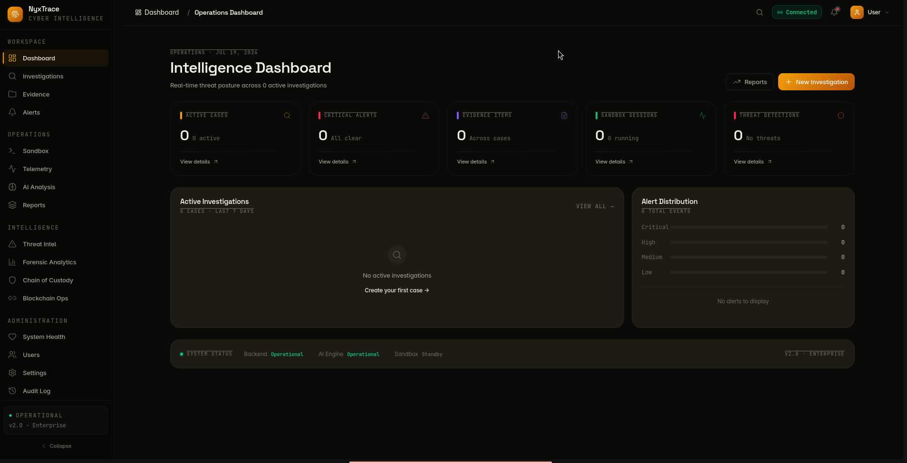

# NyxTrace

**AI-powered cybercrime digital forensics platform with blockchain-anchored evidence verification.**

<p align="center">
  
  
  
  
  
  
  
  
</p>

<p align="center">
  <em>A full-stack cybersecurity platform for safe malware behavior simulation, forensic analysis, and blockchain-anchored evidence integrity.</em>
</p>

> This is a defensive / educational project. Simulators are non-destructive and only run inside a sandbox VM with hard rollback.

<p align="center">
  
</p>

---

## Features

| Area | Description |
|------|-------------|
| Multi-Role Auth | OTP-based registration, JWT auth, 6 RBAC roles (super_admin to auditor) |
| Sandbox Simulation | VirtualBox-based headless sandbox with 6 safe behavioral simulators, WebSocket telemetry, auto snapshot rollback |
| AI Threat Analysis | FastAPI microservice for telemetry classification, anomaly detection, severity scoring, investigation summarization |
| Blockchain Evidence | Ethereum smart contract (Solidity) for evidence hash anchoring, tamper detection, on-chain audit trail |
| Forensic Dashboard | Real-time KPIs, threat intelligence graph (force-directed), MITRE ATT&CK matrix, AI analysis panels |
| Chain of Custody | Full custody timeline, integrity verification, tamper alerts with acknowledgment workflow |
| Analytics | Behavioral pattern analysis, session comparison, threat correlation, forensic reporting |
| Dark UI | Permanent dark theme with glass-morphism, CSS dot-grid texture, smooth animations throughout |

---

## Project Status

| Phase | Status | Highlights |
|-------|--------|------------|
| 1-3: Core Platform | Complete | Auth, investigations, evidence, sandbox, blockchain anchoring |
| 3.5-3.7: Intelligence | Complete | Chain of custody, threat intelligence, forensic analytics |
| 4: Hardening | Complete | Security middleware, health monitoring, correlation IDs |
| 5-6: Sandbox & UI | Complete | Headless sandbox runtime, web dashboard |
| Production Polish | In Progress | Code-splitting, env validation, test coverage |

### Intentionally Not Included

- Docker images (local dev is the supported workflow)
- HttpOnly cookie auth (JWT in localStorage, migration planned)
- Full test coverage (scaffolding exists, follow-up project)

### Simulator Realism Roadmap

| Phase | Status | Scope |
|-------|--------|-------|
| 1 — Anti-Analysis Gating | Complete | Environment-aware behavior gating (debugger, VM, analysis tools detection) |
| 2 — Real Process Injection | Complete | ctypes-based `CreateRemoteThread` + `WriteProcessMemory` into suspended `calc.exe` with benign MessageBoxW shellcode |
| 3 — Network Beaconing | Complete | Domain fronting (Host header manipulation), DNS-over-HTTPS simulation, jittered exponential-backoff heartbeats |
| 4 — Artifact Naming, Timing, Persistence | Complete | Realistic mutex/pipe/service names (T1036), operation-appropriate timing, WMI event subscription (T1546.003), COM hijacking (T1574.002) |
| 5+ — Bootkit, Driver, etc. | Pending | Follow-up phases covering remaining realism dimensions |

---

## Architecture

```
                    +-------------------------------------------------------+
                    |               Frontend (React + TypeScript + Vite)      |
                    |   Pages | Stores (Zustand) | API client | WS client    |
                    |   Framer Motion | D3.js Force Graph | Recharts Charts  |
                    +---------------------------+---------------------------+
                        | REST /api/v1              ^ WebSocket (Socket.IO)
                        v                           |
+-------------------------------------------------------+
|              Backend API (Express.js + TypeScript)      |
|  Auth/RBAC | Investigations | Evidence | Sandbox | AI   |
|  Blockchain | Health | Queues | Tracing                  |
+-------+-------------------+------------------------------+
    | HTTP              | HTTP                  | MongoDB
    v                   v                       v
+-----------+   +------------------+   +-------------------+
| AI Service|   | Sandbox Agent   |   | MongoDB           |
| (FastAPI) |   | (FastAPI :8765) |   | (local :27017)    |
| LLM Router|   | Pipeline + VBox |   | Investigations,   |
| Severity  |   | Telemetry WS    |   | evidence, alerts, |
| Anomalies |   | Logs WS         |   | sessions, IOCs    |
+-----+-----+   +-------+---------+   +-------------------+
      | HTTP              | VBoxManage
      v                   v
+-------------+  +----------------------+     +----------------------+
| Ollama      |  | VirtualBox VM        |     | Ethereum Blockchain  |
| llama3.2:3b |  | ForensicsSandbox     |     | (Hardhat / Sepolia)  |
| localhost   |  | Snapshot:            |     | EvidenceRegistry.sol |
| :11434      |  |   CleanBaselinePython|     | Audit trail + State  |
| JSON mode   |  | Simulators run here  |     +----------------------+
+-------------+  +----------------------+
```

### Technology Stack

| Layer | Tech |
|---|---|
| **Frontend** | React 19, TypeScript, Vite, Zustand, React Router, Framer Motion, Socket.IO client, D3.js, Recharts |
| **Backend** | Express.js, TypeScript, Mongoose, Socket.IO, Ethers.js, Winston, Helmet, express-rate-limit |
| **AI Service** | FastAPI, scikit-learn, pandas, uvicorn |
| **Sandbox Agent** | FastAPI, VirtualBox (VBoxManage), WebSocket streaming |
| **Blockchain** | Solidity 0.8.20, Hardhat, Ethers.js, Sepolia testnet / local Hardhat node |
| **Database** | MongoDB (local or Atlas) |
| **Auth** | JWT + refresh tokens, OTP via SMTP (Gmail app password), RBAC with 6 roles |

---

## Project Structure

```
nyxtrace/
|-- backend/                    Express.js API server (TypeScript)
|   |-- src/
|   |   |-- blockchain/         Ethereum integration (16 modules)
|   |   |   |-- smart-contract.service.ts     Contract interactions + state machine
|   |   |   |-- synchronization.service.ts    Sync queue + on-chain anchoring
|   |   |   |-- verification-orchestrator.service.ts  Coordinated verification
|   |   |   |-- verification-worker.service.ts        Parallel job queue
|   |   |   |-- verification.service.ts       Local integrity verification
|   |   |   |-- reconciliation.service.ts     DB vs blockchain reconciliation
|   |   |   |-- hashing.service.ts            SHA-256 fingerprinting + Merkle root
|   |   |   |-- transaction.service.ts        Tx lifecycle + confirmation monitoring
|   |   |   |-- state-tracking.service.ts     Health snapshots + metrics
|   |   |   |-- blockchain.service.ts         Web3 provider management
|   |   |   |-- config.ts                     Env-based configuration
|   |   |   |-- types.ts                      Enums + interfaces
|   |   |   |-- models/blockchain.model.ts    Mongoose schemas
|   |   |   |-- routes/blockchain.routes.ts   44 REST endpoints
|   |   |   +-- controllers/blockchain.controller.ts  Route handlers
|   |   |-- controllers/        Request handlers
|   |   |-- services/           Business logic, integrations
|   |   |   |-- evidence.service.ts           Upload + hashing
|   |   |   |-- health.service.ts             Aggregated health checks
|   |   |   |-- ai-analysis.service.ts        AI microservice integration
|   |   |   |-- websocket.service.ts          Socket.IO event bus
|   |   |   +-- ...
|   |   |-- routes/             REST routing
|   |   |-- middleware/         Auth, security, tracing, context
|   |   |-- models/             Mongoose schemas
|   |   +-- config/             Env + logger configuration
|   |
|-- frontend/                   React + TypeScript (Vite)
|   +-- src/
|       |-- pages/
|       |   |-- EnhancedDashboardPage           KPI cards, charts, alert feed
|       |   |-- EvidenceExplorerPage            Evidence grid + blockchain verify
|       |   |-- BlockchainOperationsPage        Sync/worker/health management
|       |   |-- ChainOfCustodyPage              Custody timeline + tamper alerts
|       |   |-- AIAnalysisPage                  AI classification + anomaly display
|       |   |-- ThreatIntelligencePage          D3 force graph + IOC browser
|       |   |-- ForensicAnalyticsPage           MITRE ATT&CK + correlation
|       |   |-- SandboxDashboardPage            Session management + telemetry
|       |   |-- LoginPage / RegisterPage        Auth with OTP flow
|       |   |-- SettingsPage                    User preferences
|       |   +-- ManifestoPage                   About / team
|       |-- stores/             Zustand state stores
|       |   |-- blockchainStore                 40+ actions (status, verify, sync, worker, reconciliation)
|       |   +-- evidenceStore                   Evidence CRUD + blockchain bridge
|       |-- components/
|       |   |-- blockchain/     BlockchainOperationsPanel, ReconciliationPanel
|       |   |-- layout/         Sidebar, Header, MainLayout
|       |   +-- ui/             GlassPanel, Badge, StatusIndicator, Charts
|       |-- services/api.ts     Typed API client
|       |-- config/             Env validation + tunable constants
|       +-- router/             React Router + role-gated routes (RoleRoute)
|
|-- blockchain/                 Smart contract development
|   |-- contracts/EvidenceRegistry.sol    Single combined contract (Solidity 0.8.20)
|   |-- test/EvidenceRegistry.test.ts     29 passing tests
|   |-- hardhat.config.ts                 Hardhat + Sepolia deployment
|   +-- scripts/deploy.ts                 Deployment script
|
|-- ai-service/                 FastAPI AI microservice (Python)
|   +-- app/                    Threat classification, severity, anomalies
|
|-- sandbox-agent-v2/           FastAPI sandbox runtime + simulators
|   |-- agent/                  Pipeline state machine, VM orchestration, telemetry
|   +-- simulators/             6 safe behavioral modules
|
|-- shared/                     Cross-service contracts + port config
|-- docs/                       Architecture notes + 9 runbooks
|-- .env.example                Sample environment config
+-- start-all.sh               Orchestrated startup (Linux / WSL)
```

---

## Blockchain Module

The blockchain module anchors evidence integrity to an Ethereum smart contract:

### Smart Contract (EvidenceRegistry.sol)

- Single combined contract implementing both evidence registration and audit trail
- State machine: PENDING to REGISTERED to TRANSFERRED to LOCKED with validated transitions
- Batch registration for bulk evidence anchoring
- On-chain verification with hash comparison
- Tamper detection with immutable audit entries
- 29 passing tests covering register, verify, batch, state transitions, tamper detection

### Backend Services (16 modules)

| Service | Purpose |
|---|---|
| **config.ts** | Env-based configuration (RPC URL, contract address, chain ID, gas settings) |
| **blockchain.service.ts** | Web3 provider management, network info, gas estimation |
| **smart-contract.service.ts** | Contract read/write operations, state machine transitions, reconciliation |
| **synchronization.service.ts** | Background sync queue with 5s auto-processing for on-chain registration |
| **verification-orchestrator.service.ts** | Coordinates hashing, DB records, and blockchain anchoring |
| **verification-worker.service.ts** | Parallel verification job queue with priority scheduling |
| **verification.service.ts** | Local evidence integrity verification (hash comparison) |
| **hashing.service.ts** | SHA-256 fingerprinting, file integrity verification |
| **transaction.service.ts** | Transaction lifecycle, confirmation monitoring, retry |
| **reconciliation.service.ts** | Detects and auto-resolves DB vs blockchain inconsistencies |
| **state-tracking.service.ts** | Monitors operational state, health snapshots |

### API Endpoints (44 routes)

All under `/api/v1/blockchain`:

| Endpoint | Purpose |
|---|---|
| `GET /status` | Blockchain connection status + verification mode |
| `POST /evidence/register` | Register evidence hash on-chain |
| `POST /evidence/verify` | Verify evidence integrity against blockchain |
| `POST /evidence/batch-verify` | Batch verification |
| `GET /verification/stats` | Verification statistics |
| `GET /verification/history/:id` | Per-evidence verification history |
| `POST /contract/register` | Direct smart contract registration |
| `POST /contract/verify` | Direct smart contract verification |
| `GET /audit` | Audit log entries |
| `GET /audit/evidence/:id` | Evidence-specific audit trail |
| `GET /sync/status` | Sync queue status |
| `POST /sync/process` | Trigger queue processing |
| `GET /worker/status` | Worker statistics |
| `POST /worker/job` | Create verification job |
| `POST /reconciliation/run` | Trigger reconciliation |
| `GET /reconciliation/issues` | List reconciliation issues |
| `GET /reconciliation/stats` | Reconciliation statistics |
| `GET /state/health` | Health metrics |
| `GET /transactions` | Transaction history |
| `GET /tamper/alerts` | Tamper alert list |

---

## API Reference

### Auth & Users

| Method | Path | Roles | Description |
|---|---|---|---|
| POST | `/auth/register` | public | Create account (sends OTP) |
| POST | `/auth/send-otp` | public | Send / resend OTP |
| POST | `/auth/verify-otp` | public | Verify OTP, return tokens |
| POST | `/auth/login` | public | Email + password login |
| POST | `/auth/refresh` | public | Exchange refresh token |
| POST | `/auth/logout` | authenticated | Revoke refresh token |
| GET | `/auth/me` | authenticated | Current user profile |
| GET | `/users` | admin+ | List all users |
| PATCH | `/users/:id` | admin+ | Update user role / status |

### Investigations & Evidence

| Method | Path | Roles | Description |
|---|---|---|---|
| GET / POST | `/investigations` | analyst+ | List / create investigations |
| GET / PATCH / DELETE | `/investigations/:id` | analyst+ | CRUD by ID |
| GET | `/evidence` | analyst+ | List evidence |
| POST | `/evidence/upload` | analyst+ | Upload evidence file |
| POST | `/evidence/:id/verify` | analyst+ | Verify evidence integrity |

### Sandbox

| Method | Path | Roles | Description |
|---|---|---|---|
| GET | `/sandbox/health` | auditor+ | Runtime health |
| GET | `/sandbox/simulators` | analyst+ | Simulator catalog |
| GET / POST | `/sandbox/sessions` | operator+ | List / start session |
| GET | `/sandbox/sessions/:id` | analyst+ | Session detail |
| POST | `/sandbox/sessions/:id/stop` | operator+ | Graceful stop |
| POST | `/sandbox/sessions/:id/terminate` | operator+ | Force terminate + rollback |
| POST | `/sandbox/vm/reset` | operator+ | Restore snapshot |
| GET | `/sandbox/vm/status` | analyst+ | VM state |

### Operations

| Method | Path | Roles | Description |
|---|---|---|---|
| GET | `/operations/health` | public | Aggregated health |
| GET | `/operations/ready` | public | K8s readiness probe |
| GET | `/operations/live` | public | K8s liveness probe |
| GET | `/operations/metrics` | public | Prometheus metrics |

### Other

| Prefix | Purpose |
|---|---|
| `/api/v1/blockchain` | Evidence registration / verification |
| `/api/v1/custody` | Chain of custody |
| `/api/v1/threat` | Threat intelligence |
| `/api/v1/analytics` | Behavioral analytics |
| `/api/v1/alerts` | Alert management |
| `/api/v1/reports` | Forensic reports |
| `/api/v1/logs` | Audit log viewer |
| `/api/v1/ai` | AI analysis forward |
| `/api/v1/settings` | Application settings |

---

## Quick Start

### Prerequisites

| Requirement | Version | Notes |
|---|---|---|
| Node.js | 18+ | Backend + frontend |
| npm | 9+ | Bundled with Node |
| Python | 3.11+ | AI service + sandbox agent |
| MongoDB | local or Atlas | Backend persistence |
| VirtualBox | 6.1+ | Only for sandbox execution |

### Linux / macOS

```bash
git clone <repo-url> nyxtrace
cd nyxtrace

# Backend
cd backend
npm install
cp .env.example .env    # fill MONGODB_URI, JWT_SECRET, JWT_REFRESH_SECRET
npm run dev              # http://localhost:3000

# Frontend (new terminal)
cd frontend
npm install
npm run dev              # http://localhost:5173
```

### Windows (WSL 2 — Recommended)

The project uses Linux-native tools (`bash`, `nohup`, `ollama serve`, VirtualBox via `VBoxManage`, `source` for Python venv activation).
**WSL 2 with Ubuntu** is the recommended way to run it on Windows — everything works as documented under WSL.

1. **Install WSL 2 + Ubuntu**
   ```powershell
   wsl --install -d Ubuntu
   ```
   Restart, then launch Ubuntu from the Start menu and set up your Linux user.

2. **Install prerequisites inside WSL**
   ```bash
   # Node.js 18+
   curl -fsSL https://deb.nodesource.com/setup_20.x | sudo -E bash -
   sudo apt-get install -y nodejs

   # Python 3.11+
   sudo apt-get install -y python3 python3-venv python3-pip

   # MongoDB
   curl -fsSL https://www.mongodb.org/static/pgp/server-7.0.asc | sudo gpg --dearmor -o /usr/share/keyrings/mongodb-server-7.0.gpg
   echo "deb [ signed-by=/usr/share/keyrings/mongodb-server-7.0.gpg ] https://repo.mongodb.org/apt/ubuntu jammy/mongodb-org/7.0 multiverse" | sudo tee /etc/apt/sources.list.d/mongodb-org-7.0.list
   sudo apt-get update && sudo apt-get install -y mongodb-org

   # Ollama (LLM backend for AI analysis)
   curl -fsSL https://ollama.com/install.sh | sh
   ```

3. **Clone and set up**
   ```bash
   git clone <repo-url> nyxtrace
   cd nyxtrace
   ```

4. **Start all services** (inside WSL terminal)
   ```bash
   ./start-all.sh
   ```
   This launches backend, AI service, sandbox agent, and frontend automatically.

5. **Access from Windows browser**
   - Frontend: `http://localhost:5173`
   - Backend API: `http://localhost:3000/api/v1`
   - All ports are forwarded by WSL 2 — no extra config needed.

**Note:** VirtualBox on the Windows host is accessible from WSL via `localhost`. MongoDB and Ollama must run inside WSL (not on the Windows host) unless you reconfigure the connection URLs.

### Windows (Native — Partial)

If WSL is not an option, you can run the Node.js services (backend + frontend) directly on Windows:

```powershell
# Backend
cd backend
npm install
Copy-Item ..\.env.example .env
notepad .env
npm run dev

# Frontend (new terminal)
cd frontend
npm install
npm run dev
```

The AI service, Ollama, and sandbox agent require WSL or a Linux VM  (they rely on `bash` scripts, `nohup`, and VirtualBox's Linux toolchain).
For the full experience, use WSL 2.

### Smart Contracts (optional)

```bash
cd blockchain
npm install
npx hardhat test         # 29 tests
npx hardhat node         # local node :8545
npx hardhat run scripts/deploy.ts --network localhost
```

---

## Sandbox Scenarios

The sandbox agent ships 6 pre-scripted educational attack scenarios that simulate real forensic artifacts for analysis. Each scenario emits structured telemetry (registry changes in JSON, file operations, network connections) as if generated by live malware — but via deterministic scripted output rather than executing actual malware.

| Internal ID | Simulated Behavior |
|---|---|
| `system-service-alpha` | File system operations, encryption routines, system modification |
| `system-service-beta` | Network connections, persistence, child process spawning |
| `system-service-gamma` | Credential store access, sensitive registry reads, data staging |
| `system-service-delta` | User activity monitoring, screen data capture, document scanning |
| `system-service-epsilon` | Deep persistence install, boot configuration changes, process injection |
| `system-service-lateral` | Network discovery, SMB enumeration, pass-the-hash, remote execution |

These scenarios are designed to teach forensic analysis patterns — identifying registry persistence, tracing network connections, detecting credential access — without requiring live malware samples. The telemetry format is identical to what real analysis tools produce, so the AI classification, chain of custody, and reporting pipelines work identically whether the data comes from a scenario or a real sandbox execution.

### Simulator Realism — Phase 1 (Anti-Analysis Gating)

All 6 simulators now incorporate environment-aware behavior gating via `check_environment()` in `telemetry_helper.py`:

| Verdict | Behavior |
|---------|----------|
| `CLEAN` | Full simulation — all phases execute normally |
| `SUSPICIOUS` | Noisy/high-risk phases are skipped (process injection, SAM/LSA reads, exfiltration, boot modification, keylogger hook, clipboard monitoring, pass-the-hash, remote service creation, WMI execution) |
| `COMPROMISED` | Simulator exits early with no malicious activity |

Detection checks include: debugger presence, VM artifacts (registry, disk, BIOS), analysis tool processes, unusual screen resolution, small disk size, and low CPU core count. This allows the sandbox to train EDR/analyst responses to malware that adapts its behavior based on the environment.

### Simulator Realism — Phase 2 (Real Process Injection)

Phase 6 of `sim_epsilon.py` (process injection) now performs actual ctypes-based Windows API injection rather than emitting telemetry alone:

| Step | API | Detail |
|------|-----|--------|
| 1 | `CreateProcessW` | Spawn `calc.exe` with `CREATE_SUSPENDED` |
| 2 | `VirtualAllocEx` | Allocate `PAGE_EXECUTE_READWRITE` memory in target |
| 3 | `WriteProcessMemory` | Write benign x64 shellcode (MessageBoxW call) |
| 4 | `CreateRemoteThread` | Execute shellcode in target process |
| 5 | `ResumeThread` | Resume main thread after shellcode completes |
| 6 | `TerminateProcess` | Clean up the injected process |

The shellcode calls `MessageBoxW(0, "Process Injection Test", "NyxTrace", 0)` — entirely benign. The MessageBoxW address is resolved at runtime via `GetProcAddress` from the injecting process (Python), embedded into the shellcode before writing. All emit telemetry calls for `OPEN_PROCESS`, `WRITE_MEMORY`, and `CREATE_THREAD` are preserved so the EDR analysis pipeline sees the same forensic signals it would from a real injection.

### Simulator Realism — Phase 3 (Network Beaconing)

A shared `c2_helper.py` module provides four realistic C2 traffic primitives used across all 4 network-capable simulators:

| Primitive | Function | Detail |
|-----------|----------|--------|
| Domain Fronting | `fronted_beacon()` | Connects to sinkhole IP but sets HTTP `Host` header to a trusted CDN domain (e.g. `www.google-analytics.com`, `cdn.example-cdn.com`), mimicking malware that hides behind CDN infrastructure |
| DNS-over-HTTPS | `emit_doh_query()` | Sends a TCP connection to the DoH resolver sinkhole with an HTTP POST mimicking RFC 8484 `application/dns-message` upload, evading plaintext DNS monitoring |
| Jittered Sleep | `jittered_sleep()` | Triangular jitter around base interval (± jitter) — substitutes for fixed `time.sleep()` calls |
| Exponential Backoff | `backoff_sleep()` | Full-jitter exponential backoff `U(0, min(cap, base×2^attempt))` — used when a C2 endpoint is unreachable |
| Heartbeat Chain | `emit_heartbeats()` | Sends N staggered heartbeats with random intervals between `min_interval` and `max_interval`, each carrying a unique session ID |

**Simulators updated:**

| Simulator | Phase(s) | Improvement |
|-----------|----------|-------------|
| `botnet_sim.py` | `dns_beacon`, `http_beacon` | Added `emit_doh_query()` to DNS phase; replaced raw TCP beacon with `fronted_beacon()` + `DOMAIN_FRONT` telemetry for all 6 HTTP beacons |
| `credential_stealer_sim.py` | `dropper`, `exfiltration` | Dropper now uses `fronted_beacon()` with `DOMAIN_FRONT` telemetry + DoH query; exfiltration per-file uses per-file front domain + trailing `emit_heartbeats()` |
| `sim_delta.py` | `exfiltration` | Replaced raw `socket.connect()` with `fronted_beacon()` + `DOMAIN_FRONT` telemetry; trailing `emit_heartbeats()` with 8–20s jitter |
| `sim_epsilon.py` | `c2_callback` | Replaced single socket connect with fronted beacon + DoH query + 4-part heartbeat chain (4–20s intervals) |

All source IPs remain in non-routable `10.0.0.0/8` ranges; all payloads are benign metadata JSON.

### Simulator Realism — Phase 4 (Artifact Naming, Timing, Persistence)

A shared `naming_helper.py` module provides realistic artifact naming and operation-appropriate timing:

- **`pick_mutex()` / `pick_pipe()`** — realistic mutex/pipe names from known malware families (Stuxnet, WannaCry, TrickBot, etc.) plus randomized generated names with company-prefixed convention
- **`pick_service_name()` / `pick_com_description()`** — convincing service names and COM object descriptions for persistence primitives
- **`phase_delay(operation)`** — operation-specific timing maps (0.05–2.0s ranges) replacing uniform `jitter()` calls

**New persistence phases added:**

| Simulator | Phase | Technique | Detail |
|-----------|-------|-----------|--------|
| `botnet_sim.py` | Mutex | T1036 | Creates Global\MSCTF.CacheMutex (Stuxnet-style) then deletes it |
| `botnet_sim.py` | WMI Persistence | T1546.003 | Event filter + consumer + binding via `__EventFilter`, `CommandLineEventConsumer`, `__FilterToConsumerBinding` |
| `credential_stealer_sim.py` | Pipe | T1036 | Creates `\\.\pipe\lsass` with impersonation to simulate named pipe hijack |
| `sim_epsilon.py` | COM Hijacking | T1574.002 | Writes CLSID reg key under `HKCU\Software\Classes\CLSID` with InprocServer32 + TreatAs pointing to simulated payload DLL |

**Timing (`jitter()` → `phase_delay()`):**

| Simulator | Phases Updated |
|-----------|---------------|
| `botnet_sim.py` | mutex, download, process_inject, dns_beacon, http_beacon |
| `credential_stealer_sim.py` | keylogger, clipboard, dropper, exfiltration |
| `sim_delta.py` | all phases (enumeration, exfiltration) |
| `sim_epsilon.py` | anti_analysis, service_persistence, hidden_files, process_inject |
| `ransomware_sim.py` | file_create, file_encrypt |
| `sim_lateral.py` | port_scan, smb_connect, credential_harvest, pth_auth, service_create, wmi_exec |

---

## Roles & Permissions (RBAC)

| Role | Typical use | Notable permissions |
|---|---|---|
| `super_admin` | Owner | Everything |
| `admin` | Platform operator | User management, runtime control, all read/write |
| `forensic_analyst` | Investigator | Investigations, evidence, alerts, sandbox execute |
| `security_reviewer` | Reviewer | Read-only across investigations, evidence, alerts |
| `sandbox_operator` | Sandbox console | Sandbox sessions only |
| `auditor` | Compliance | Audit logs, custody chain, read-only evidence |

### Registration Flow

| Method | Available Roles | Who Can Do It |
|--------|----------------|---------------|
| Self-registration (`/register`) | `forensic_analyst`, `admin` | Public |
| User management panel (`/users`) | All 6 roles | `admin` / `super_admin` only |
| Role assignment page (`/roles`) | All 6 roles, permission-level control | `super_admin` only |

Self-registration is intentionally limited to 2 roles. A `super_admin` or `admin` promotes users to higher-privilege roles via the admin panel after vetting. The admin panel at `/users` now exposes all 6 roles for user creation and editing.

---

## Observability

- **Aggregated health** at `/api/v1/operations/health` — per-service breakdown (database, websocket, queue, sandbox, AI, blockchain)
- **Prometheus metrics** at `/api/v1/operations/metrics?format=prometheus`
- **Correlation IDs** — X-Correlation-ID traces end-to-end across all services
- **Structured logs** — Winston JSON (backend), Python logging (sandbox)

---

## Useful URLs

| Service | URL |
|---|---|
| Frontend | http://localhost:5173 |
| Backend API | http://localhost:3000/api/v1 |
| Backend Health | http://localhost:3000/api/v1/operations/health |
| AI Service | http://localhost:8000 |
| Sandbox Agent | http://127.0.0.1:8765 |
| Telemetry WS | ws://127.0.0.1:8765/telemetry/live |
| Hardhat Node | http://127.0.0.1:8545 |

---

## Documentation

Operational and architectural details live in `docs/`:

- **Architecture:** blockchain-evidence-verification.md, smart-contracts-evidence-verification.md
- **Runbooks:** blockchain-operations-runbook.md, deployment-runbook.md, developer-environment.md, execution-runbook.md, forensic-analytics-runbook.md, operational-runbook.md, threat-intelligence-runbook.md

---

## Contributing

1. Fork the repository
2. Create a feature branch (`git checkout -b feat/your-feature`)
3. Commit changes using [Conventional Commits](https://www.conventionalcommits.org/) (`feat:`, `fix:`, `chore:`, etc.)
4. Push and open a pull request

---

## License

[MIT](LICENSE)

## Disclaimer

This software is for educational and research purposes only. It simulates malware behavior in a controlled sandbox to teach forensic analysis. Use only on systems you own or are authorized to test.
