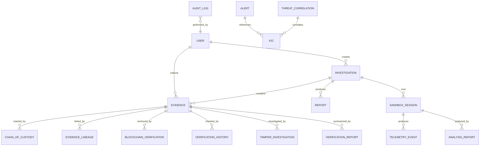
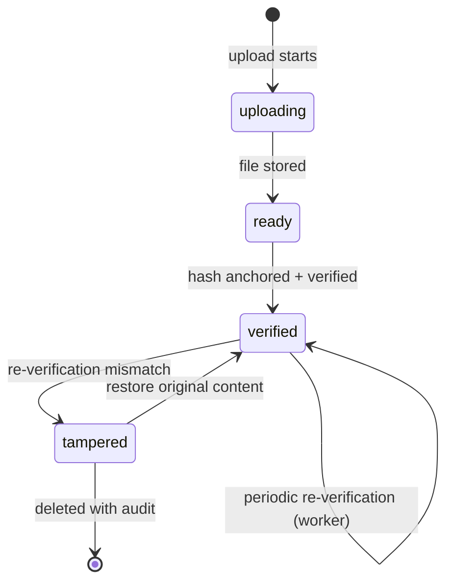

# Data Model

## Domain Overview

Thirteen+ Mongoose models grouped by domain (`backend/src/models/`):

## Entity Groups

### Identity & Access

| Model | Key fields | Notes |
|-------|-----------|-------|
| `User` | email, password (bcrypt, `select:false`), firstName/lastName, department, role, isActive, isLocked, failedLoginAttempts, mustChangePassword | RBAC 6 roles; computed display `name`; role-change audit trail |

### Investigations & Evidence

| Model | Key fields | Notes |
|-------|-----------|-------|
| `Investigation` | title, description, status, priority, category, phase, caseNumber, createdBy, leadAnalyst | Lifecycle state machine |
| `Evidence` | evidenceId, investigationId, name, fileName, filePath, fileSize, mimeType, type, source, status (`uploading/ready/verified/tampered`), hash, tamperedHash, collectedBy, description | Integrity state machine; hash + tamperedHash drive FR-EV-04..07 |
| `EvidencePackageHash` | package-level hash records | Supports batch integrity |

### Chain of Custody

| Model | Key fields | Notes |
|-------|-----------|-------|
| `ChainOfCustody` | evidenceId, eventType, actor, from/to, timestamp, notes | Append-only per artifact (FR-CO-01) |
| `EvidenceLineage` | parent/child evidence refs | FR-CO-02 |
| `VerificationHistory` | evidenceId, hash at check, result, verifiedBy | Every verification logged |
| `TamperInvestigation` | evidenceId, tamper details, findings, status | Links to FR-EV-05/06 |
| `VerificationReport` | report of integrity verification runs | FR-BC-02 |

### Sandbox & Telemetry

| Model | Key fields | Notes |
|-------|-----------|-------|
| `SandboxSession` | sessionId, vmName, simulatorId, simulatorName, status (pending/running/completed/failed/timeout), startTime, eventsCollected, errorMessages, executionSummary, recentEvents, suspiciousEvents, extractedIOCs, aiAnalysis, rollbackStatus | Sub-document arrays use explicit `type: { type: String }` syntax |
| `TelemetryEvent` | evidenceId, investigationId, sessionId, eventType, timestamp, metadata, raw | Normalized at ingestion (DD-10) |
| `AnalysisReport` | reportId, type, status, severity, executiveSummary, aiAnalysis | AI-assisted analysis output |

### Alerts & Threat Intelligence

| Model | Key fields | Notes |
|-------|-----------|-------|
| `Alert` | title, description, severity, status, source, iocIndicators | Generated from analysis/anomalies |
| `IOC` | indicator value, type, severity, status | Threat intelligence entries |
| `ThreatCorrelation` | correlation of IOCs across investigations | |
| `ThreatEnrichment` | enrichment results per IOC | |
| `ThreatAnalytics` | aggregated threat metrics | |

### Reporting & Analytics

| Model | Key fields | Notes |
|-------|-----------|-------|
| `Report` | reportId, investigationId, title, type, status, severity, executiveSummary, aiAnalysis, version, publishedBy | Versioned (FR-RE-01) |
| `Analytics` | metricType, metricName, period, value, breakdown | Aggregated metrics |
| `DailySummary` | date, investigations, evidence, alerts, sandbox, userActivity, performance | Dashboard aggregates |
| `InvestigationMetrics` | investigationId, primaryAnalyst, per-case metrics | |

### Operations

| Model | Key fields | Notes |
|-------|-----------|-------|
| `AuditLog` | userId, action, entityType, entityId, ipAddress, status, details, timestamp | All sensitive actions (NFR-03) |
| `KnowledgeArticle` | title, excerpt, content, category, type, readTime, published | Guides/references/tutorials |
| `BlockchainVerification` | evidenceId, txHash, block, network, status | Local mirror of on-chain state (FR-BC-02) |
| `BlockchainSyncQueue` | pending anchor/verify work | Reconciliation when node returns (DD-08) |
| `EvidenceIntegrity` | integrity records for periodic verification | Worker-driven |
| `ScratchSession` / `ScratchVariant` | throwaway analysis workspaces | Operational helper |

## Integrity State Machine (Evidence)

