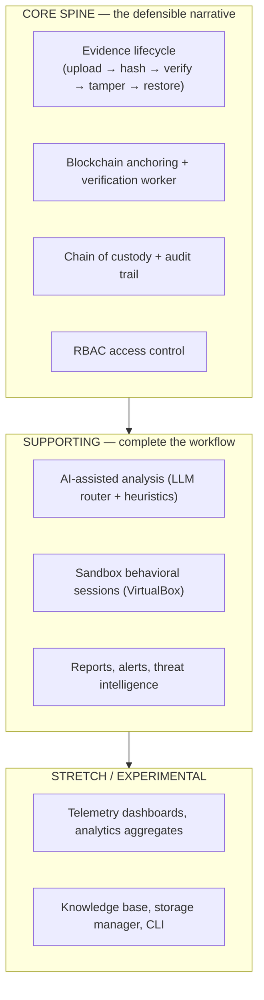

# Scope & Authorship

## Core Spine vs Supporting Modules

The platform is organized around one core narrative — **evidence integrity
anchored on a blockchain** — with supporting modules around it. This
distinction drives the report structure and the demo script.

### Core Spine

| Module | Purpose | Primary evidence |
|--------|---------|------------------|
| Evidence lifecycle | Hash, verify, tamper-detect, restore artifacts | `backend/src/services/evidence.service.ts`, `evidence.demo.test.ts` |
| Blockchain anchoring | Immutable hash records + tamper records | `blockchain/contracts/EvidenceRegistry.sol`, `backend/src/blockchain/*` |
| Chain of custody | Append-only custody + lineage | `backend/src/models/custody.model.ts`, custody routes |
| RBAC | 6-role permission enforcement | `backend/src/types/index.ts`, user routes + tests |

### Supporting Modules

| Module | Purpose |
|--------|---------|
| AI-assisted analysis | Threat classification, MITRE mapping, attack chains, severity, narratives (dual-gated LLM router) |
| Sandbox sessions | Controlled behavioral execution with live telemetry and event sync |
| Reports & alerts | Versioned reports, alert workflow, IOC management |

### Stretch Modules

| Module | Purpose |
|--------|---------|
| Dashboards & analytics | Operational aggregates, daily summaries, forensic analytics |
| Knowledge base | Guides/references for the analyst workflow |
| Storage manager / CLI | Operational helpers (usage views, `nyx.sh`/`nyx.cmd` launchers) |

Stretch modules are fully functional but are presented as *extensions* of the
core narrative, not the focus of the thesis claim.

## Authorship Map

Tooling-neutral inventory of where each part of the system comes from. This
map supports the report's "methodology & tooling" section and the viva.

| Area | Core logic (project-specific) | Libraries / frameworks / boilerplate |
|------|-------------------------------|--------------------------------------|
| Backend | Evidence integrity state machine, blockchain service + sync + verification worker, RBAC guards, audit service, sandbox event normalization, idempotent anchoring | Express, Mongoose, Socket.IO, JWT (jsonwebtoken), bcryptjs, ethers v6, ts-node-dev |
| Frontend | Routing + page structure, Zustand stores, API client normalization (`_id`→`id`), design system (CSS-first Tailwind v4 theme), role-gated navigation | React 19, Vite 8, Tailwind v4, axios, lucide-react, Zustand |
| AI Service | Telemetry analysis modules, feature extraction, Z-score anomaly detection, severity scoring, LLM router with dual-gate + fallback, cache + rate limiter | FastAPI, Pydantic v2, pytest, (Ollama client) |
| Blockchain | `EvidenceRegistry.sol` (evidence + tamper records), deploy scripts, typechain integration | Hardhat, ethers v6, chai |
| Sandbox Agent | VM orchestration pipeline (REVERT→BOOT→STAGE→EXECUTE→OBSERVE→COMPLETE), 6+ simulator scenarios, JSON-lines telemetry emission | FastAPI, VirtualBox (VBoxManage), Python stdlib |
| Docs & tooling | ADRs/design docs, runbooks, CI workflow, demo/QA scripts | GitHub Actions, markdown tooling |

### Contribution Notes (for the report)

- **Student-owned design decisions** are documented in
  `docs/design/design-decisions.md` (DD-01 … DD-11) — each carries context,
  decision, and consequence and reflects deliberate engineering trade-offs.
- **Generated/assisted portions** (boilerplate scaffolding, repeated UI
  tokens, test fixtures) are identifiable per the tooling declaration in the
  report's methodology section and are not the core of the contribution
  claim.
- **Verification of authorship** is possible end-to-end: every claim in the
  design docs maps to concrete source files and tests listed above.