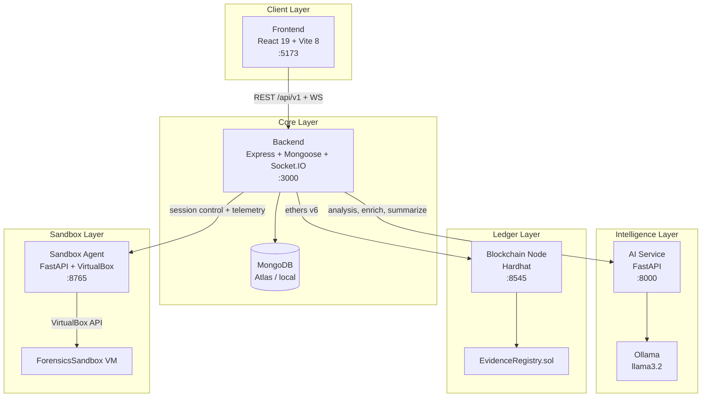
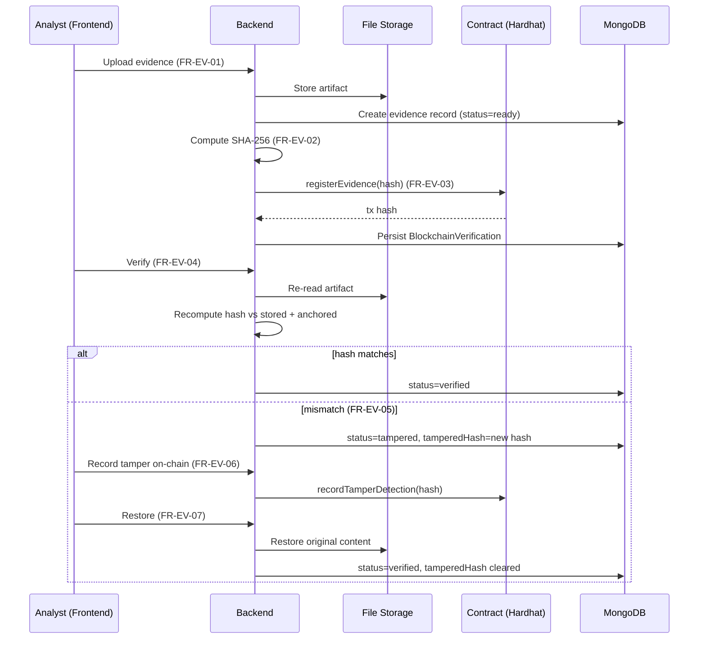
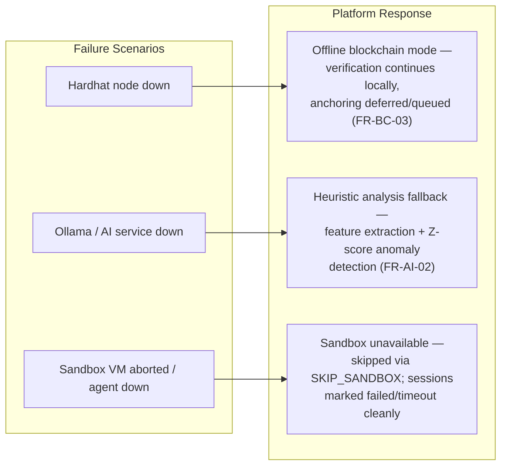

# System Architecture

## Services

## Port Map

| Service | Port | Entry |
|---------|------|-------|
| Backend | 3000 | `backend/src/index.ts` (ts-node-dev) |
| Frontend | 5173 | `frontend/src/main.tsx` (Vite dev server) |
| AI Service | 8000 | `ai-service/app/main.py` (uvicorn) |
| Blockchain | 8545 | `npx hardhat node` |
| Sandbox Agent | 8765 | `sandbox-agent-v2/main.py` |

## Core Spine — Evidence Integrity Flow

This is the central narrative of the platform: **collect → hash → anchor →
verify → detect → record → restore**. Every step is persisted and audited.

## Degradation Paths

The platform treats every external dependency as optional:

## WebSocket Events

- `/logs/live` — sandbox pipeline logs streamed from the agent through the
  backend to the frontend.
- Backend socket namespace carries live telemetry, alert, and event counters
  shown in the header (`WS: LIVE · API: OK · EVT: n · ALR: n`).

## Request Flow (representative)

1. Frontend calls `http://localhost:5173` → Vite dev server proxies `/api` to
   `http://localhost:3000` and `/ws` to the backend socket.
2. Every API request carries a `X-Correlation-ID` header generated on the
   client, traced end-to-end across backend and sandbox agent logs.
3. Backend middleware: `authenticate` (JWT) → `authorize`/`requirePermission`
   (RBAC) → controller → service → model/blockchain/agent.
4. Responses are normalized in the API client (`_id` → `id`, computed display
   `name`) so the UI never touches Mongo internals.